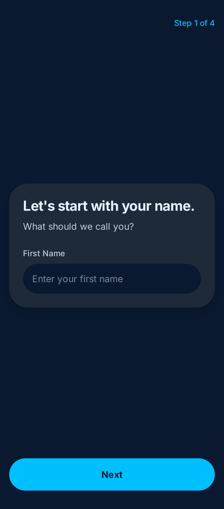
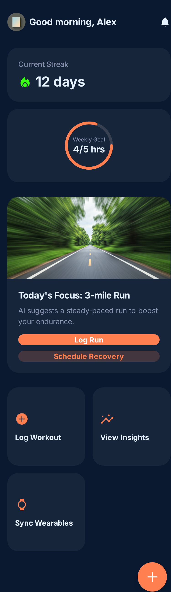
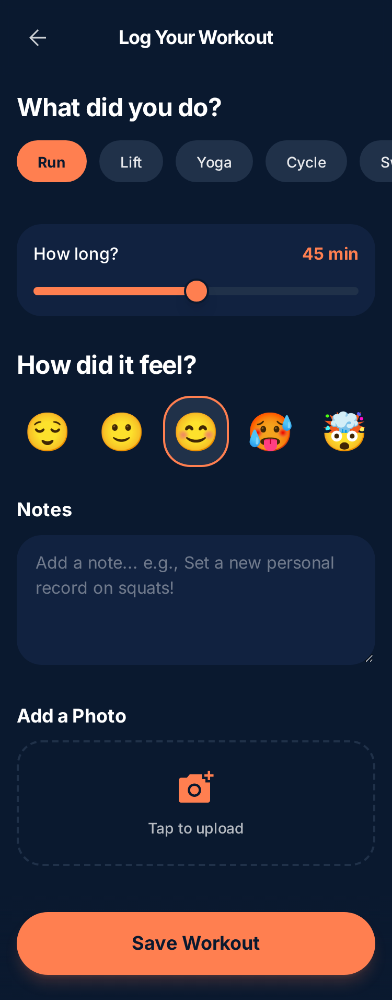
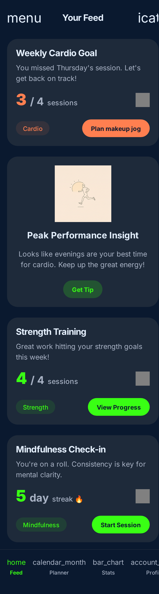
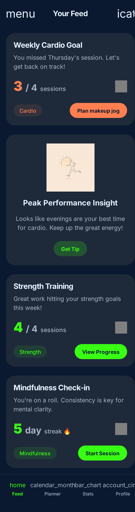
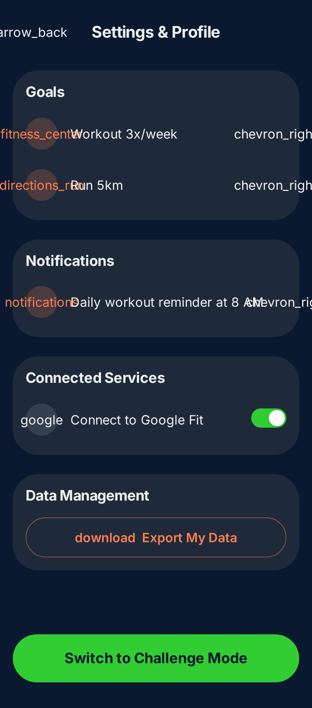
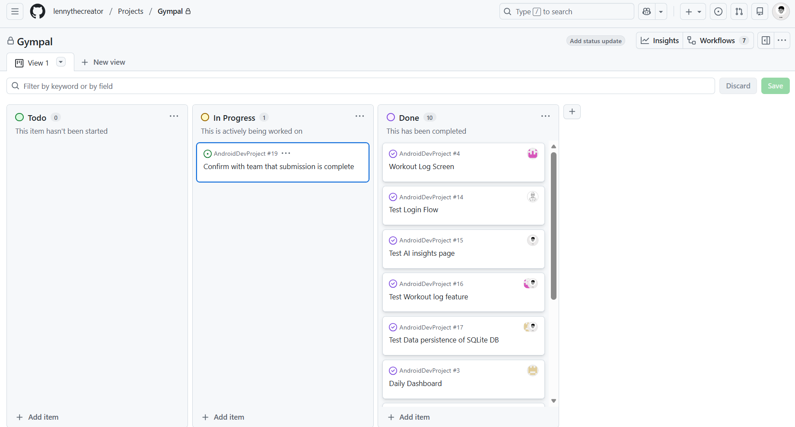
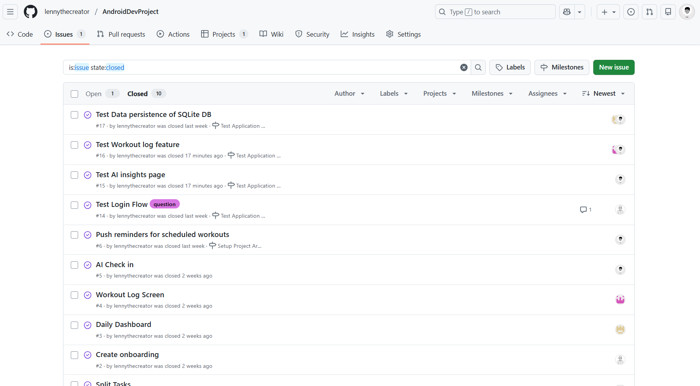
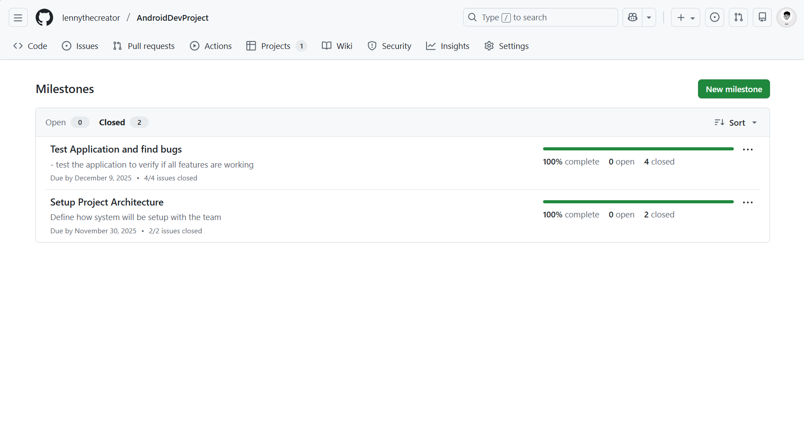

# Milestone 1 - GymPal[Final working name](Unit 7)

## Table of Contents

1. [Overview](#Overview)
1. [Product Spec](#Product-Spec)
1. [Wireframes](#Wireframes)

## Overview

### Description

GymPal App is a personal mobile coach for students who want structured accountability. It lets users set fitness goals, track workouts and habits, and receive AI-generated check-ins that highlight consistency, celebrate wins, and suggest next steps.

### App Evaluation

- **Category:** Health & Fitness / Productivity
- **Mobile:** Phones are always with students, letting the app deliver at-the-moment nudges (push reminders, widget glance), quick photo logging via camera, and motion data capture without extra hardware.
- **Story:** “Busy students need a lightweight coach that nudges them toward realistic weekly goals.”
- **Market:** College students and young professionals who want accountability without a gym membership; can expand to broader wellness market.
- **Habit:** Daily reminder streaks, weekly AI recaps, and challenge badges to encourage recurrent use.
- **Scope:** Core experience centers on four screens (onboarding, dashboard, log, insights) that are feasible within the semester while still leaving room for optional integrations.

## Product Spec

### 1. User Features (Required and Optional)

**Required Features**

1. Goal onboarding to capture focus areas (strength, cardio, mindfulness) and weekly time commitment.
2. Daily dashboard with progress ring, streaks, and today’s recommended action.
3. Workout log form (preset templates + custom notes) with option to attach progress photo.
4. AI Check-In card that summarizes adherence, highlights missed areas, and suggests adjustments.
5. Push reminders for scheduled workouts and weekly summary notifications.

**Optional Features**

1. Sync basic metrics from Google Fit / Apple Health for automatic workout detection.
2. Social challenge mode with a small leaderboard among classmates.
3. Smart meal suggestions aligned with the current training focus.

### 2. Screen Archetypes

- **Onboarding Flow**
  - Collect name, fitness goals, preferred workout days/times, notification permissions.
- **Dashboard**
  - Shows goal progress, streak count, next task, and quick access to log or AI insight.
- **Log Session**
  - Form with exercise type, duration, intensity slider, notes, and photo upload.
- **AI Insights**
  - Feed of generated summaries (“You hit 3/4 cardio targets this week; add one more light run tomorrow.”) with actionable buttons.
- **Profile & Settings**
  - Manage goals, connected services, reminder schedule, and data export.

### 3. Navigation

**Tab Navigation** (Tab to Screen)

* Dashboard – overview & quick actions
* Log – start new workout entry / habit check
* Insights – AI summaries & recommendations
* Profile – settings, goals, integrations

**Flow Navigation** (Screen to Screen)

- Launch → Onboarding → Dashboard
- Dashboard → Log Session → Confirmation → Dashboard
- Dashboard → Insights → Detailed Insight → Suggested action (e.g., schedule workout)
- Profile → Edit Goals → Confirmation → Dashboard

## Wireframes

Onboarding flow

Dashboard (Home tab)

Log Session form

AI Insights tab – summary view

AI Insights tab – detail card

Profile & Settings

 

 

---

# Milestone 2 - Build Sprint 1 (Unit 8)

## GitHub Project board

## Issue cards

## Issues worked on this sprint

- **Backend API Development**: Implemented FastAPI backend server with SQLite database for user management, workout tracking, and AI insights 

- **User Authentication and Onboarding Integration**: Built signup and login functionality with session management using SharedPreferences.Connected onboarding flow to backend API to persist user profile data (name, age, weight, height, activeness level, fitness goals)

- **Workout Logging**: Implemented workout form to save exercises, sets, reps, and duration of workouts

- **Dashboard Data Integration**: Connected home dashboard to fetch and display real-time user profile, workout averages, and current goals from backend

- **AI Insights Screen**: Built AI insights screen with performance metrics and AI-generated suggestions

- **AI Chat Feature**: Implemented interactive chat functionality in AI Insights screen allowing users to have contextual conversations with AI about their fitness data, with chat history persisted in database

- **UI Improvements**: Added a floating button in insights screen that allows the user to chat with the AI.

[Add giphy that shows current build progress for Milestone 2. Note: We will be looking for progression of work between Milestone 2 and 3. Make sure your giphys are not duplicated and clearly show the change from Sprint 1 to 2.]

 